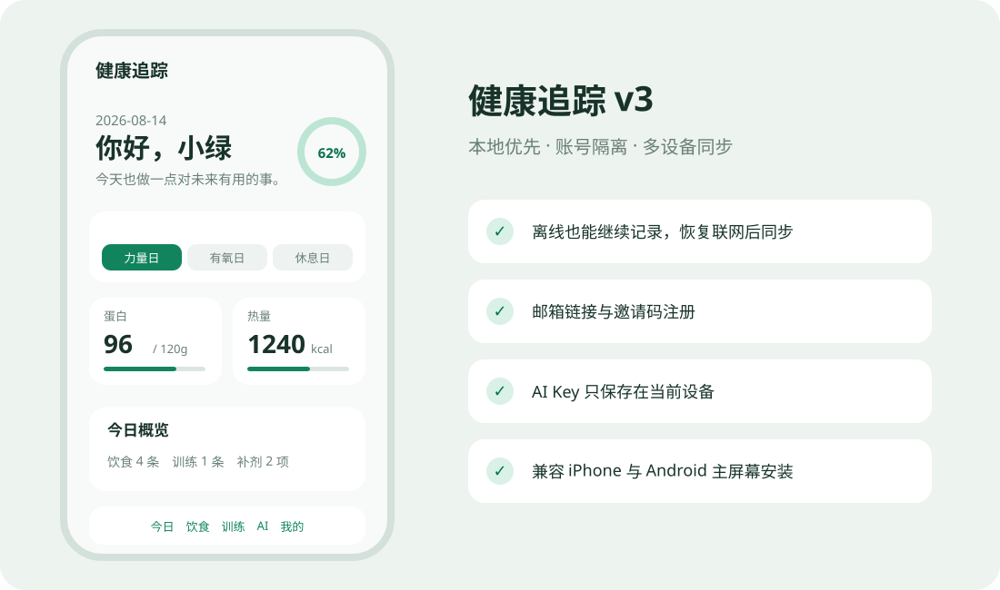

# 健康追踪 v3

一个面向成年人日常健康管理的开源 PWA，支持饮食、训练、体重趋势、补剂打卡、AI 辅助、离线记录与多设备同步。界面针对手机设计，可安装到 iPhone 和 Android 主屏幕。

在线地址：[https://joechongchzh.github.io/health-app/](https://joechongchzh.github.io/health-app/)



> 本项目不提供医学诊断、处方或特殊人群治疗建议。出现不适或异常指标请咨询医生。

## 功能

- 五栏移动端界面：今日、饮食、训练、AI、我的
- 按档案和日型动态计算营养配额，女性 BMR 使用正确的 Mifflin-St Jeor 公式
- IndexedDB 本地优先；离线增删改、恢复联网与前台时自动同步
- Supabase 邮箱六位验证码登录、邀请码注册、RLS 账号隔离
- 条目级 UUID、版本、软删除和冲突处理，避免整天 JSON 相互覆盖
- 旧版 `ht_data_v1` 预览、备份、幂等迁移；v3 JSON 导入导出
- AI 文字、视觉、语音接口分别配置，兼容 HTTPS OpenAI 风格接口
- AI Key 仅保存在当前设备，不同步、不导出
- PWA 离线缓存、Apple Touch Icon 和新版本更新提示

## 隐私模型

- 传输使用 HTTPS；云端使用 Supabase RLS 按 `user_id` 隔离。
- 不提供端到端加密，Supabase 项目管理员理论上可以访问云端明文健康数据。
- AI Key、AI 对话、图片缩略图、GitHub Token 不进入云同步、JSON 导出或错误日志。
- 删除账号会通过受保护的 Edge Function 删除 Auth 用户并级联清理云端数据，同时清除本地数据库和本机 AI Key。

详见 [隐私说明](docs/PRIVACY.md) 和 [数据库设计](docs/DATABASE.md)。

## 本地开发

要求 Node.js 22+、pnpm 11.19.0。云端功能需要 Supabase CLI 与 Docker。

```bash
pnpm install
cp .env.example .env.local
pnpm dev
```

未配置 Supabase 时，开发环境会显示“本地开发预览”，便于调试 UI；生产构建不会开放该入口。

常用命令：

```bash
pnpm lint
pnpm format:check
pnpm typecheck
pnpm test
pnpm test:e2e
pnpm build
supabase start
pnpm test:db
```

## Supabase 配置

1. 创建 Supabase 项目，启用 Email OTP，并让模板发送 `{{ .Token }}` 六位验证码。
2. 将 `.env.example` 复制为 `.env.local`，填入项目 URL 和 publishable/anon key。
3. 执行 `supabase db push`。
4. 部署函数：

   ```bash
   supabase functions deploy redeem-invite
   supabase functions deploy delete-account
   ```

5. 在 SQL Editor 创建邀请码（明文不会存表）：

   ```sql
   insert into public.invite_codes(code_hash, label, max_uses, expires_at)
   values (crypt('替换为邀请码', gen_salt('bf')), '朋友', 10, now() + interval '30 days');
   ```

6. 在 GitHub 仓库 Variables 配置 `VITE_SUPABASE_URL`、`VITE_SUPABASE_PUBLISHABLE_KEY`。

Service Role Key 只由 Supabase Edge Function 环境使用，绝不能放入 `.env.local`、GitHub Pages 或前端构建。

## 部署与自托管

仓库默认以 `/health-app/` 为 base path，通过 GitHub Actions 部署 GitHub Pages。自托管到根路径时修改 `vite.config.ts` 的 `base`、manifest 的 `start_url/scope` 和 `index.html` 中图标路径。

完整步骤见 [部署文档](docs/DEPLOYMENT.md)。

## 旧版迁移

首次登录后如果检测到 `ht_data_v1`，应用会显示记录数量。确认迁移时先下载旧 JSON 备份，再拆分为 v3 记录；稳定 ID 确保重复导入不会产生重复记录。旧 localStorage 仅在第二次确认后删除。“我的→安装与数据”也可直接导入旧 `health-data` JSON。

旧同步 JSON 中出现过的 GitHub Token 或 AI Key 必须轮换。删除仓库数据文件不能清除 Git 历史中的旧凭据。详见 [迁移文档](docs/MIGRATION.md)。

## 项目文档

- [架构](docs/ARCHITECTURE.md)
- [数据库与 RLS](docs/DATABASE.md)
- [隐私与安全](docs/PRIVACY.md)
- [部署与发布](docs/DEPLOYMENT.md)
- [迁移](docs/MIGRATION.md)
- [好友使用指引](docs/FRIEND-GUIDE.md)
- [故障排除](docs/TROUBLESHOOTING.md)

## 已知限制

- iOS PWA 不依赖后台同步；请偶尔打开应用，让前台同步完成。
- AI 接口兼容性取决于服务商是否实现对应的 OpenAI 风格端点。
- 餐馆、外卖和图片识别营养值只能作为估算。
- 真实 iPhone Safari/主屏幕模式与 Android Chrome/安装模式仍属于每次正式发布的人工作验收项。

## 参与贡献

请阅读 [CONTRIBUTING.md](CONTRIBUTING.md) 和 [CODE_OF_CONDUCT.md](CODE_OF_CONDUCT.md)。安全问题请按 [SECURITY.md](SECURITY.md) 私下报告。

## License

[MIT](LICENSE)
